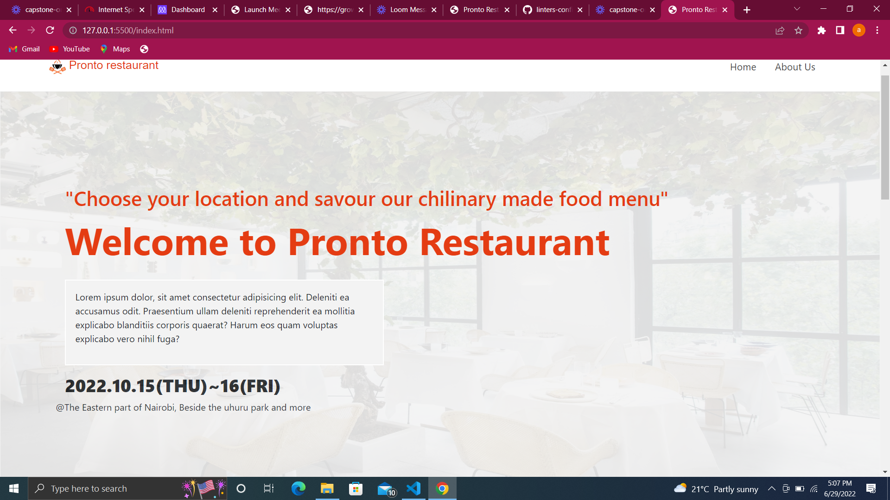

# capstone-1

Welcome to Pronto restaurant

pronto restaurant. A place where you can eat food from many different cultures with your family or friends. just come and enjoy
Here is a link on how i describe the project

[Project description video](https://www.loom.com/share/5f3cdb83b7064a709efc47c3f4ab87ce)

## Built With

- Html, CSS and bootstrap
- VS studio as IDE

## Live Demo

[My Live Demo Link](https://abass-rashid.github.io/capstone-1/)

### Prerequisites

- Clone git repository from the main branch

- inside of the cloned repository, run the index.html on a browser

- Or you can just directly access it by clicking here
  [My Live Demo Link](https://abass-rashid.github.io/capstone-1/)

## 🤝 Contributing

Contributions, issues, and feature requests are welcome!

Feel free to check the [issues page](https://github.com/Abass-rashid/capstone-1/issues).

## Acknowledgments

- [Cindy Shin](https://www.behance.net/gallery/29845175/CC-Global-Summit-2015) from who I got my inspiration
- Morning session team who helped me figure out some things

## Show your support

Give a ⭐️ if you like this project!

## Authors

👤 **Abass rashid**

- GitHub: [@Abass-rashid](https://github.com/Abass-rashid)
- Twitter: [@Abass10](https://twitter.com/Abass10)
- LinkedIn: [LinkedIn](https://linkedin.com/in/Abass-rashid)

## 📝 License

This project is [MIT](./MIT.md) licensed.
